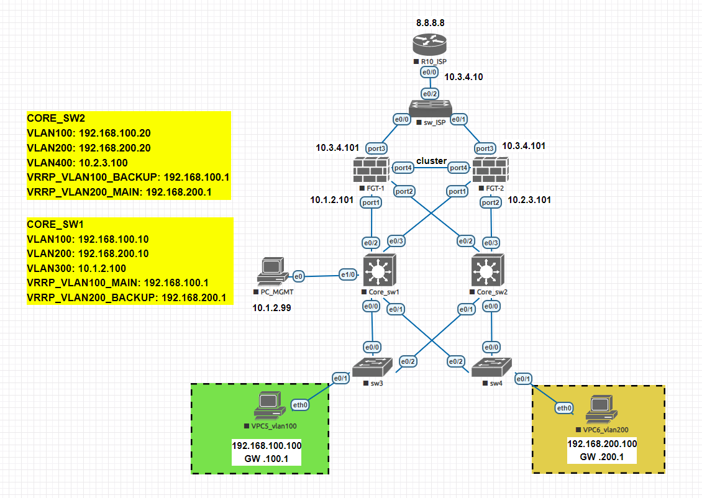

# Network-Topology-with-Dual-Core-Switches-and-Clustered-Firewalls-FORTIGATE

## Tổng Quan

Dự án này chi tiết việc cấu hình và thiết lập cơ sở hạ tầng mạng. Thiết kế bao gồm các thiết bị mạng khác nhau như router, firewall, switch, và máy tính trong các VLAN khác nhau. Mục tiêu là cung cấp một cấu trúc mạng mạnh mẽ, an toàn và hiệu quả cho một tổ chức.

## Sơ Đồ Mạng

### Các Thành Phần:

- **Router (R10_ISP)**: Hoạt động như cổng kết nối ra Internet với IP `8.8.8.8`.
  
- **Switch ISP (sw_ISP)**: Kết nối với router ISP và firewall để quản lý lưu lượng truy cập giữa ISP và mạng nội bộ.

- **Firewalls (FGT-1, FGT-2)**: 
  - **FGT-1** có IP bên ngoài là `10.3.4.101` trên `port3` và IP nội bộ là `10.1.2.101` trên `port1`.
  - **FGT-2** có IP bên ngoài là `10.3.4.101` trên `port3` và IP nội bộ là `10.2.3.101` trên `port2`.
  - Cả hai firewall là một phần của cụm khả dụng cao (high-availability cluster) để dự phòng.

- **Switches Lõi (Core_sw1, Core_sw2)**:
  - **Core_sw1** kết nối với `FGT-1`,`FGT-2`,`Core_sw1`,`Core_sw2`.
  - **Core_sw2** kết nối với `FGT-1`,`FGT-2`,`Core_sw1`,`Core_sw2`.
  
- **VLANs**:
  - **VPC5_vlan100**: 
    - Địa chỉ IP: `192.168.100.100`
    - Gateway: `192.168.100.1`
    - Kết nối với `sw3`.
  - **VPC6_vlan200**: 
    - Địa chỉ IP: `192.168.200.100`
    - Gateway: `192.168.200.1`
    - Kết nối với `sw4`.

- **Máy Tính Quản Lý (PC_MGMT)**:
  - Địa chỉ IP: `10.1.2.99`
  - Được sử dụng để quản lý và điều hành mạng.
  
## Chi Tiết Cấu Hình

### Cấu Hình Router (R10_ISP)
- Giao diện `e0/0`: `10.3.4.10` (kết nối với SW_ISP)
- Định tuyến đến `8.8.8.8` (địa chỉ lootback mặc định)

### Cấu Hình Firewall (FGT-1 và FGT-2)
- Được cấu hình cho Khả Năng Khả Dụng Cao (HA) trong chế độ Active-Passive.
- Các giao diện nội bộ kết nối với Switch Lõi.
- Các giao diện bên ngoài kết nối với switch ISP.

### Cấu Hình VLAN
- **VLAN 100**: Gán cho VPC5 với phạm vi IP `192.168.100.0/24`.
- **VLAN 200**: Gán cho VPC6 với phạm vi IP `192.168.200.0/24`.

### Cấu Hình Switch (Core_sw1, Core_sw2, sw3, sw4)
- **Core_sw1 và Core_sw2**: Kết nối dự phòng với cả hai firewall và với nhau.
- **sw3 và sw4**: Kết nối với các VPC trong các VLAN khác nhau để phân đoạn mạng cách ly.

## Cải Tiến Trong Tương Lai

- Triển khai các chính sách và quy trình bảo mật chuyên dụng.
- Tích hợp các công cụ giám sát như Zabbix hoặc Prometheus.
